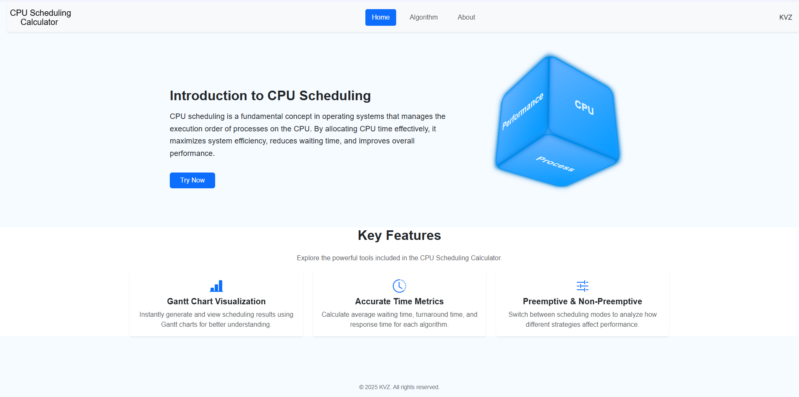
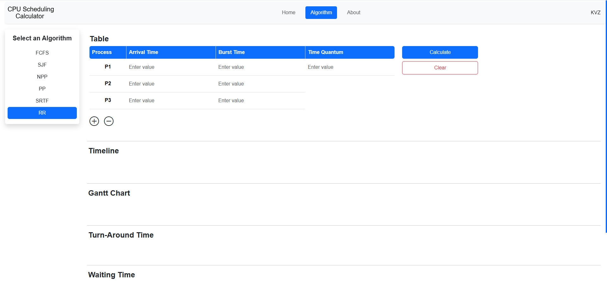

# 🧠 CPU Scheduling Calculator

A minimalist web-based tool for simulating and visualizing CPU scheduling algorithms like FCFS, SJF, SRTF, Priority Scheduling, and Round Robin. Built for students and developers learning operating systems.

## 📷 Screenshots

### 🔹 Home Page


### 🔹 Input Form
<p align="center">
  
  
</p>

### 🔹 Gantt Chart Output
<p align="center">
  
  
</p>

### 🔹 Table Output


### 🔹 About Page


---

## 🚀 Features

- 🔁 Supports Preemptive and Non-Preemptive Scheduling
- ⏱ Gantt Chart Generation
- 📊 Calculates Waiting Time, Turnaround Time, and Response Time
- 📱 Responsive Design (Mobile/Desktop)
- 🧮 Algorithms: FCFS, SJF, SRTF, Priority, Round Robin

---

## 📷 Demo

[🔗 Live Preview](https://marckevzzz.github.io/CPU-Scheduling-Calculator/) <!-- Replace with your actual link if hosted -->

---

## 📦 Tech Stack

- **Frontend:** HTML, CSS, JavaScript
- **Frameworks/Libraries:** Bootstrap 5
- **Visualization:** Custom JS Gantt Chart

---

## 📥 How to Use

1. Clone the repository:

   ```bash
   git clone https://github.com/marcKevzzz/CPU-Scheduling-Calculator.git
